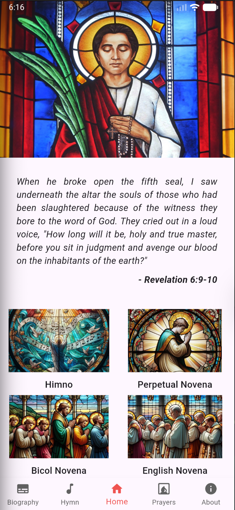
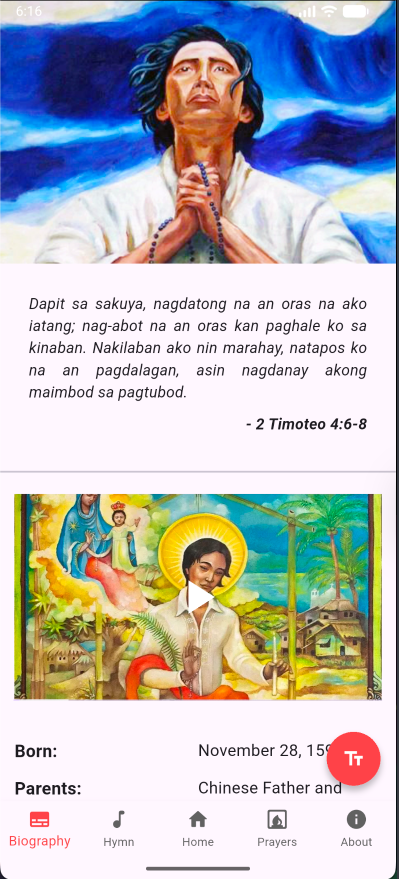
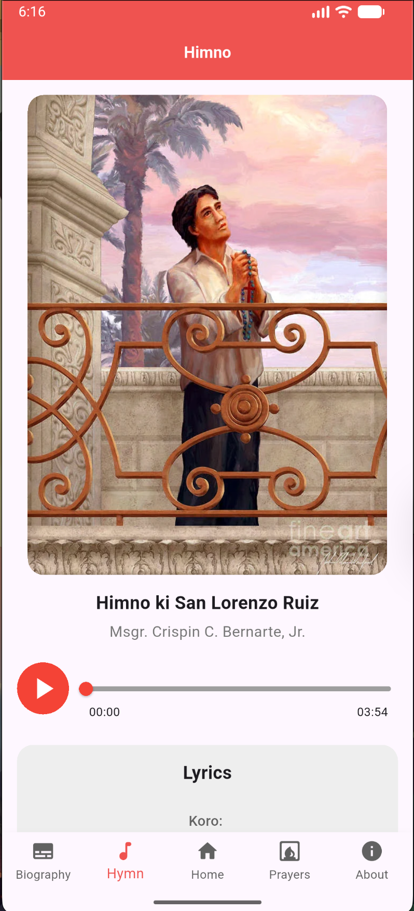
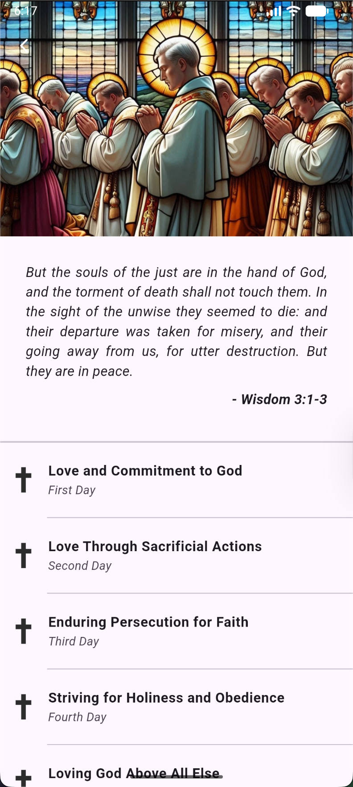
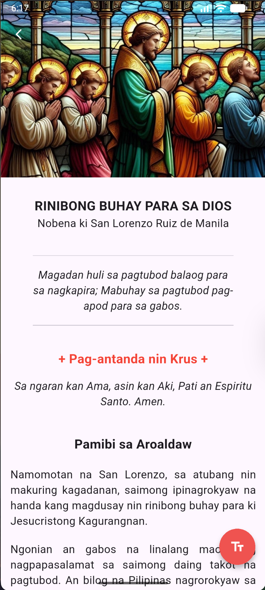

  
# St. Lorenzo Ruiz Novena

Novena to St. Lorenzo Ruiz is an offline novena app for devotees. It contains different prayers in English and in Bicol Language.

**DOWNLOAD THE APPLICATION**

## Screenshots

## App Contents
- Novena in Bicol and English: Pray in the language you prefer.
- Perpetual Novena: Available in both Bicol and English versions.
- Hymn to St. Lorenzo Ruiz: Sing along with the beautiful hymn in Bicol, complete with lyrics.
- Ten Special Prayers to St. Lorenzo:
    - Financial Blessings
    - Family Guidance
    - Support for Overseas Filipino Workers
    - Job Seekers
    - Students
    - Overcoming Doubts and Fears
    - Strengthening Faith
    - Morning and Night Prayers
    - Healing Prayer
    - Biography of St. Lorenzo Ruiz: Learn about the life and martyrdom of the first Filipino saint.

## App Features
- Hymn Player: Listen to the hymn while following along with the lyrics.
- Smart Notifications:
    - Reminders every 28th day of the month to pray the Perpetual Novena.
    - Daily reminders from September 19 to 27 to pray the Novena leading up to his feast day.
    - Special notification on September 28 (St. Lorenzo Ruiz's Feast Day) to play the hymn.
    - Customizable Prayer Text: Adjust the font size (Small, Normal, Large) to suit your reading preference.

 

