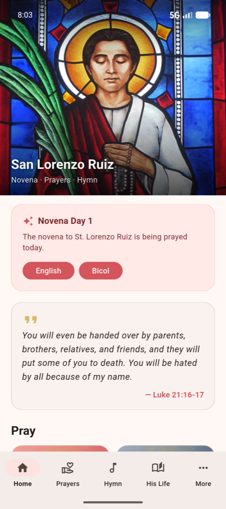
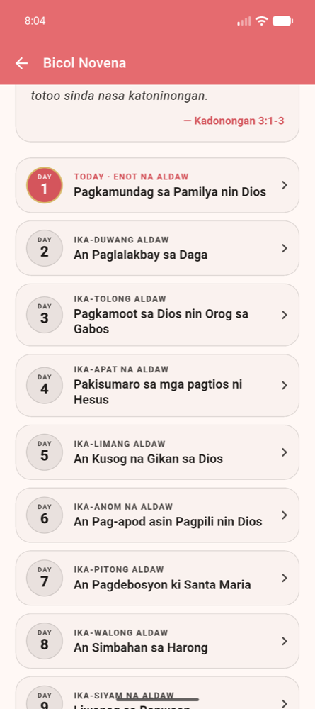
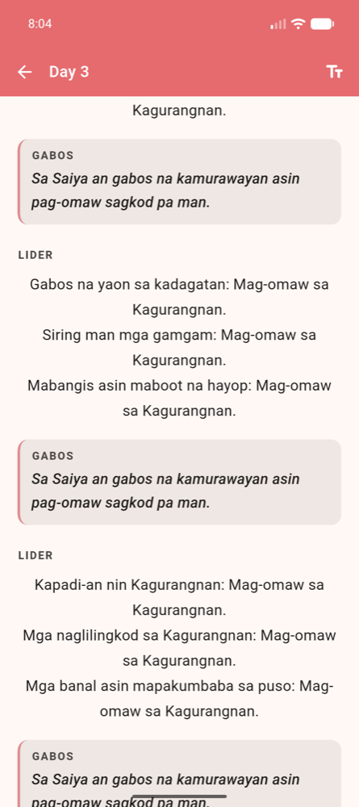
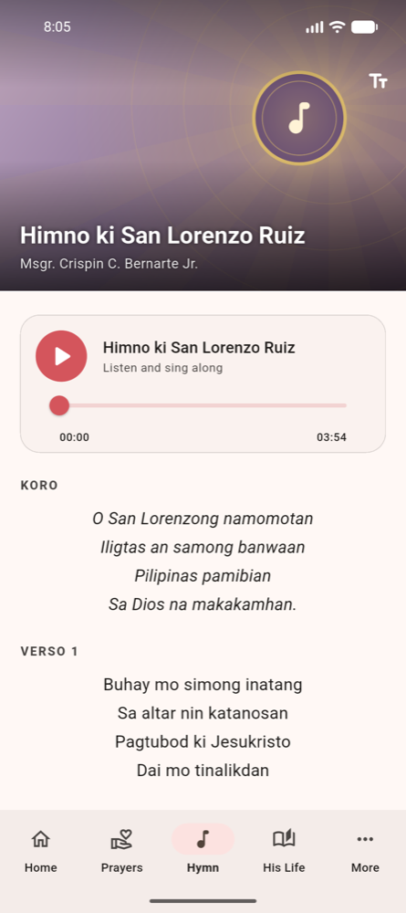
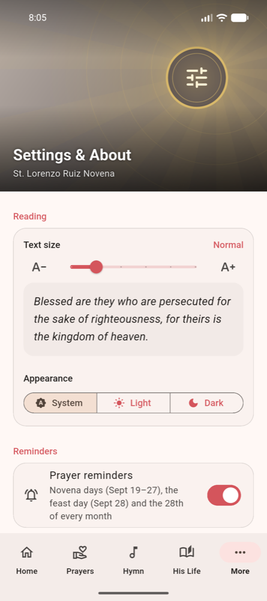

<div align="center">
  

  # St. Lorenzo Ruiz Novena

  An offline Flutter devotional app for praying the novena to St. Lorenzo Ruiz in English and Bikol.

  [](https://flutter.dev/)
  [](https://dart.dev/)
  [](https://developer.android.com/)
  [](https://github.com/jirrroooo/Novena_San_Lorenzo_Ruiz/actions)

  [](https://play.google.com/store/apps/details?id=com.jiro.st_lorenzo_ruiz_novena)
</div>

## Overview

St. Lorenzo Ruiz Novena is a mobile prayer companion for devotees of the first Filipino saint. The app keeps the core devotional content available offline, including novena pages, perpetual novena prayers, special intention prayers, scripture, biography content, and a hymn player.

The app is built with Flutter and uses local JSON content files, BLoC state management, local notification scheduling, shared preferences, and bundled media assets.

## Screenshots

<div align="center">
  
  
  
  
  
</div>

## Features

| Area | Details |
| --- | --- |
| Offline devotional content | English novena, Bikol novena, perpetual novena, scripture, biography, and prayers are bundled with the app. |
| Bilingual prayer flow | Separate English and Bikol novena experiences help devotees pray in the language they prefer. |
| Hymn player | Includes the St. Lorenzo Ruiz hymn audio asset with lyrics. |
| Prayer reminders | Schedules monthly devotion reminders every 28th day and annual novena reminders from September 19 to 28. |
| Feast day notification | Sends a September 28 reminder for the feast day of St. Lorenzo Ruiz. |
| Adjustable reading experience | Persistent text size control on every reading screen, plus light, dark and system themes. |
| App release automation | GitHub Actions builds the Android App Bundle, creates a GitHub release, and uploads a draft to the Google Play production and closed testing tracks. |

## App Modules

```text
lib/
├── app/                     App shell (MaterialApp, bottom navigation)
├── core/
│   ├── content/             JSON content loader, generic ContentCubit, devotion calendar
│   ├── services/            Reminders, logging, external links
│   ├── settings/            Persisted theme, text size and reminder settings
│   ├── theme/               Colours and light/dark ThemeData
│   └── widgets/             Shared headers, header art, reading typography, cards
├── data/                    Local JSON devotional content
└── features/
    ├── about/               Settings & about tab
    ├── biography/           Life of St. Lorenzo Ruiz
    ├── himno/               Hymn player and lyrics
    ├── home/                Home tab
    ├── novena_bikol/        Bicol novena
    ├── novena_english/      English novena
    ├── perpetual_novena/    Perpetual novena (every 28th)
    ├── prayers/             Prayers for intentions
    └── scripture/           Random scripture verse card
```

## Tech Stack

| Layer | Tools |
| --- | --- |
| Framework | Flutter |
| Language | Dart |
| State management | flutter_bloc (one ContentCubit per screen) |
| Audio | just_audio, audio_session |
| Notifications | flutter_local_notifications, flutter_timezone, timezone |
| Persistence | shared_preferences |
| Links | url_launcher |
| Android release | Gradle (AGP 8.13, Kotlin 2.2), GitHub Actions, Play Developer API (`scripts/play_upload.py`) |

## Getting Started

### Prerequisites

- Flutter stable SDK `3.44.9` (the version used by CI)
- Dart SDK `^3.12.0`
- JDK 17
- Android Studio or Android SDK command-line tools
- A configured Android emulator or physical device

### Install Dependencies

```bash
flutter pub get
```

### Run the App

```bash
flutter run
```

### Analyze and Test

```bash
flutter analyze
flutter test
```

## Android Release Signing

Release signing is automatic across local and CI/CD environments. The Android Gradle config checks for signing values in this order:

1. Environment variables, used by GitHub Actions and any local shell that exports signing values.
2. `android/key.properties`, used for local release builds.
3. Default CI keystore path `android/app/keystore.jks` when signing secrets are available and `STORE_FILE` is not set.

Required signing values:

| Name | Description |
| --- | --- |
| `STORE_PASSWORD` | Password for the Android keystore. |
| `KEY_PASSWORD` | Password for the signing key. |
| `KEY_ALIAS` | Alias of the signing key inside the keystore. |
| `STORE_FILE` | Optional path to the keystore file. Defaults to `android/app/keystore.jks` in CI. |

Example local `android/key.properties` (git-ignored, never commit it):

```properties
STORE_PASSWORD=your-store-password
KEY_PASSWORD=your-key-password
KEY_ALIAS=your-key-alias
STORE_FILE=/absolute/path/to/keystore.jks
```

Example local environment variables:

```bash
export STORE_PASSWORD="your-store-password"
export KEY_PASSWORD="your-key-password"
export KEY_ALIAS="your-key-alias"
export STORE_FILE="/absolute/path/to/keystore.jks"
flutter build appbundle --release
```

If a release build is missing signing values or the keystore file cannot be found, Gradle fails early with a clear error message.

## CI/CD

The workflow in `.github/workflows/flutter_ci_cd.yml` has two jobs:

- **Analyze & test** runs on every push and pull request (`dart format`, `flutter analyze`, `flutter test`).
- **Build & upload release** runs on pushes to `main` after the checks pass:
  1. Reads the version from `pubspec.yaml` and skips the release if tag `v<version>` already exists.
  2. Validates the signing and Play secrets.
  3. Builds a signed release App Bundle.
  4. Creates the GitHub release and tag (only after a successful build).
  5. Uploads the bundle once and adds it as a **draft** to both the **production** and **closed testing** (`alpha`) tracks. Nothing goes live until it is released in the Play Console.

To use a custom closed testing track, change `PLAY_TRACKS` in the workflow.

Required GitHub Actions secrets:

| Secret | Purpose |
| --- | --- |
| `STORE_PASSWORD` | Android keystore password. |
| `KEY_PASSWORD` | Android signing key password. |
| `KEY_ALIAS` | Android signing key alias. |
| `KEYSTORE` | Base64-encoded Android keystore file. |
| `PLAY_AUTH_JSON` | Google Play service account JSON. |

## Content and Assets

The app content is stored locally under `lib/data/`, while images and audio are stored under `assets/`. `assets/splash/` holds the native splash sources (not bundled) and `docs/` holds README media. The bundled paths are registered in `pubspec.yaml` so the app can work without an internet connection for devotional content.

## Release Versioning

App versioning is controlled in `pubspec.yaml`:

```yaml
version: 1.0.7+8
```

The CI/CD workflow uses the semantic version before `+` as the GitHub release tag, for example `v1.0.7`.

## Project Links

- [Google Play listing](https://play.google.com/store/apps/details?id=com.jiro.st_lorenzo_ruiz_novena)
- [GitHub Actions](https://github.com/jirrroooo/Novena_San_Lorenzo_Ruiz/actions)
- [Flutter documentation](https://docs.flutter.dev/)
